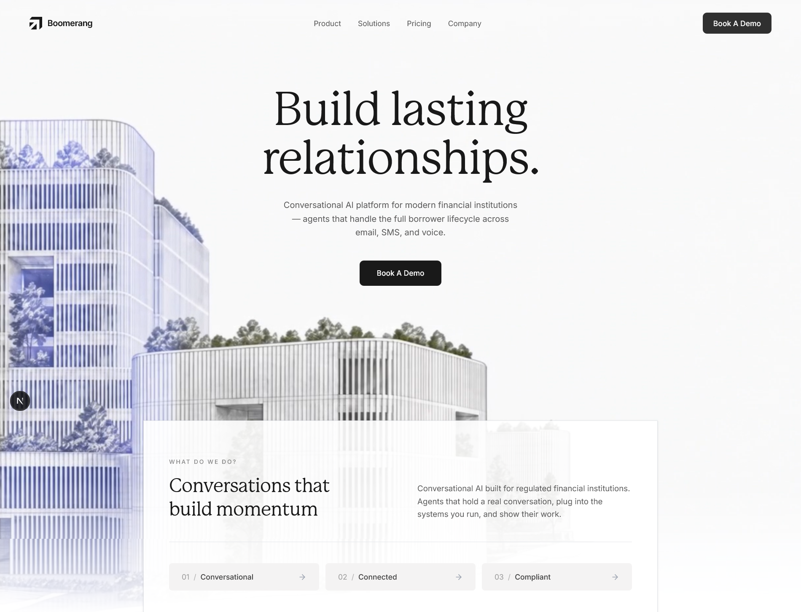

# Boomerang — Modern Landing Page UI/UX Showcase

> **Note**: Boomerang is a **fictional concept company**. This repository is a frontend design showcase focused on modern web aesthetics, motion layouts, and interactive UI components.



---

## 🎨 UI/UX & Design Highlights

- **Glassmorphism Navigation**: Floating header bar with `backdrop-blur-2xl` frosted glass effect, seamless responsive visibility toggles, and minimalist SVG branding.
- **Hero Video & Gradient Blending**: Full-bleed architectural video background layer (`BoomerangVideoBg`) with a custom bottom gradient fade that smoothly transitions video into the page surface.
- **Layered Visual Depth**: Overlapping floating card layout (`mb-[-120px]`) in the hero section that connects the top visual media with the lower section content.
- **Interactive Bento Grid**: Flexible Bento grid layout (`BentoSection.tsx`) showcasing dynamic component states, interactive tabs, visual feature cards, and micro-interactions.
- **Monochrome Design System**: Clean high-contrast palette built around dark slate/black (`#191919`) accents, subtle borders, crisp modern typography, and structured whitespace.
- **Fluid & Responsive Layout**: Fully responsive grid systems and flex container layouts optimized for desktop, tablet, and mobile displays.

---

## 🛠️ Tech Stack

- **Framework**: [Next.js 16](https://nextjs.org/) (App Router)
- **UI Library**: [React 19](https://react.dev/)
- **Language**: [TypeScript 5](https://www.typescriptlang.org/)
- **Styling**: [Tailwind CSS v4](https://tailwindcss.com/)
- **Icons**: [Lucide React](https://lucide.react.dev/)

---

## 📂 Project Structure

```
trust-flow-finance/
├── app/
│   ├── components/
│   │   ├── BentoSection.tsx       # Interactive feature bento grid & UI cards
│   │   ├── BoomerangVideoBg.tsx   # Video background hero & gradient overlay
│   │   ├── Footer.tsx             # Page footer with clean navigation links
│   │   └── Navbar.tsx             # Floating glassmorphism navbar header
│   ├── globals.css                # Global CSS rules & Tailwind CSS imports
│   ├── layout.tsx                 # Root layout & page head metadata
│   └── page.tsx                   # Main page layout combining section designs
├── public/                        # Static assets (background video, icons)
├── landing-page-screenshot.png    # High-resolution UI preview screenshot
├── package.json                   # Dependencies and scripts
└── tsconfig.json                  # TypeScript configuration
```

---

## 🚀 Getting Started

### Prerequisites

- **Node.js**: v18.0.0 or higher
- **npm**: v9.0.0 or higher

### Local Setup

1. **Clone the repository**:
   ```bash
   git clone <repository-url>
   cd trust-flow-finance
   ```

2. **Install dependencies**:
   ```bash
   npm install
   ```

3. **Run the development server**:
   ```bash
   npm run dev
   ```

4. Open [http://localhost:3000](http://localhost:3000) in your browser.

---

## 📜 Available Scripts

| Command | Description |
| :--- | :--- |
| `npm run dev` | Launches Next.js dev server with hot-reloading |
| `npm run build` | Builds the production bundle |
| `npm run start` | Runs the production server |
| `npm run lint` | Runs ESLint for code validation |
